# Block Diagram Architecture

## System Architecture Overview

This document provides visual representations of the StoreIt system architecture using block diagrams and flowcharts.

---

## 1. High-Level System Architecture

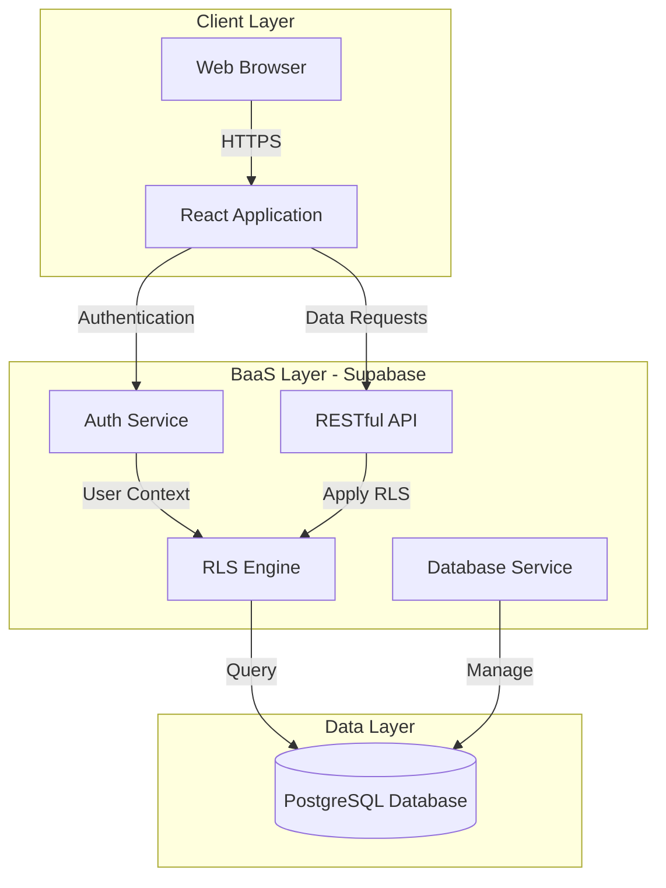

---

## 2. Three-Tier Architecture

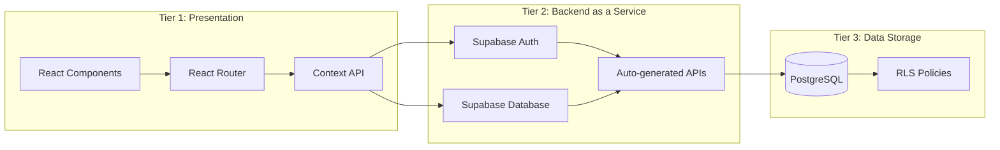

---

## 3. User Role Hierarchy

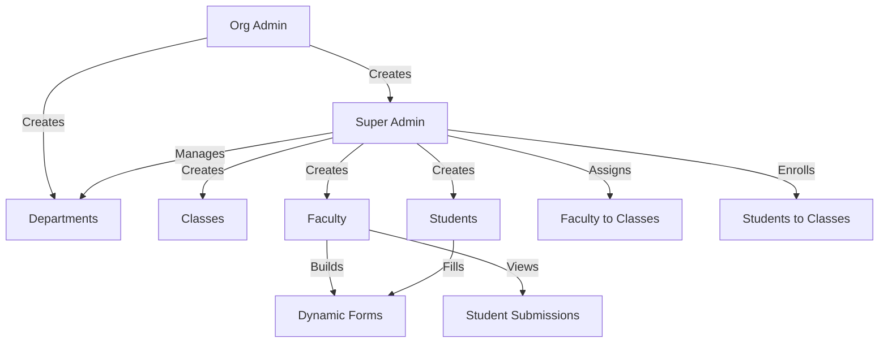

---

## 4. Authentication Flow

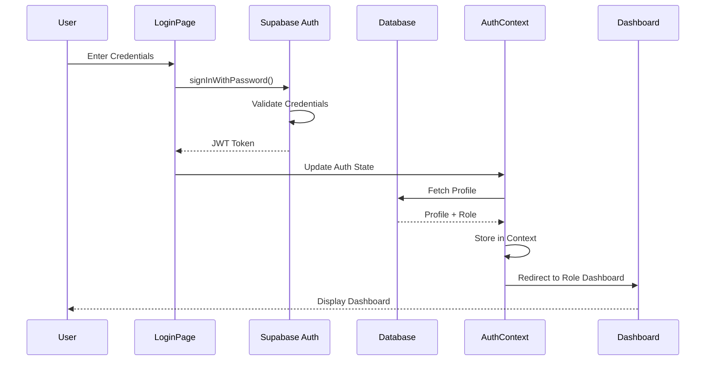

---

## 5. Component Architecture

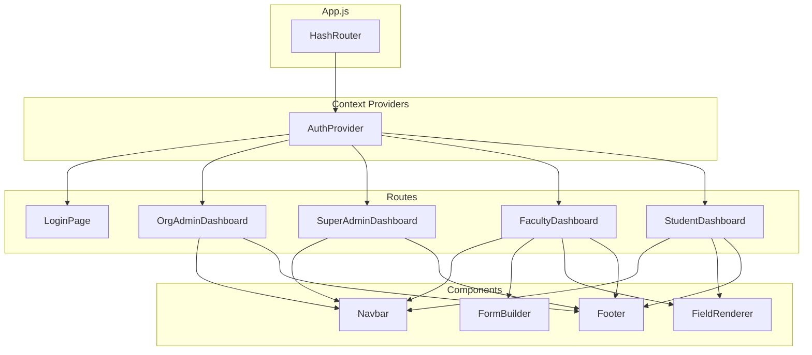

---

## 6. Database Schema Relationships

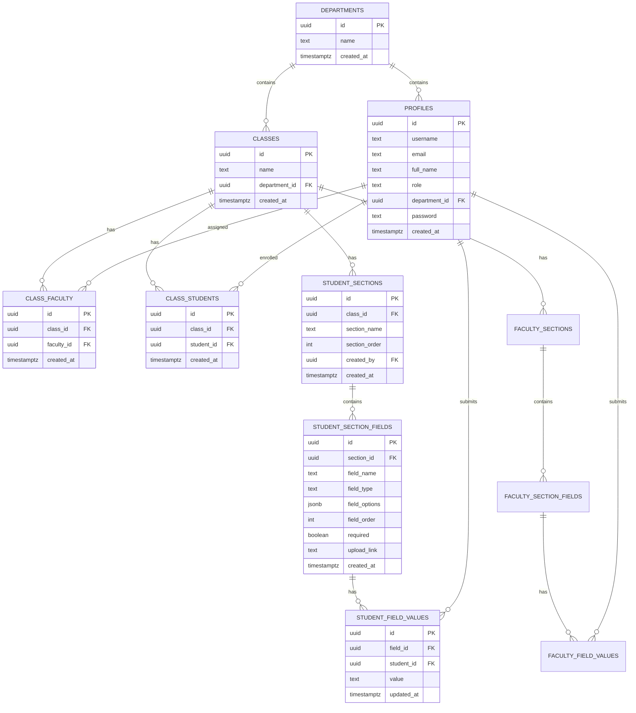

---

## 7. Form Creation Workflow (Faculty)

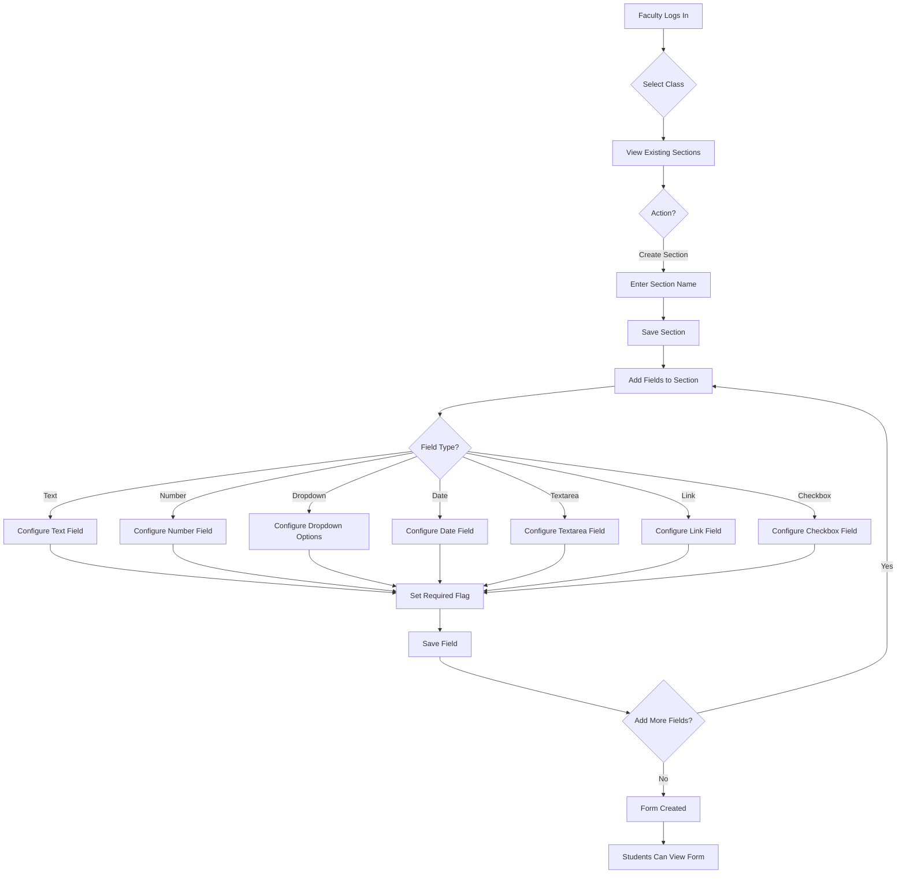

---

## 8. Form Submission Workflow (Student)

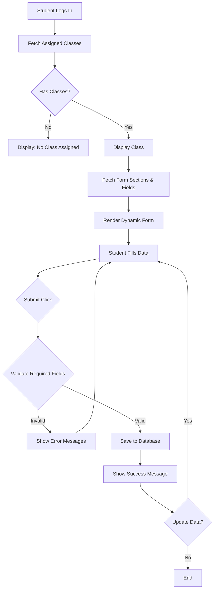

---

## 9. Data Flow Diagram

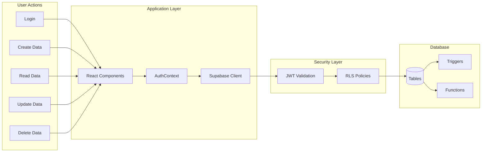

---

## 10. Cascade Deletion Flow

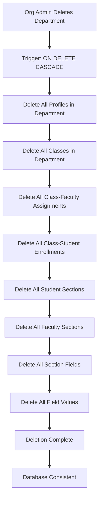

---

## 11. Security Architecture

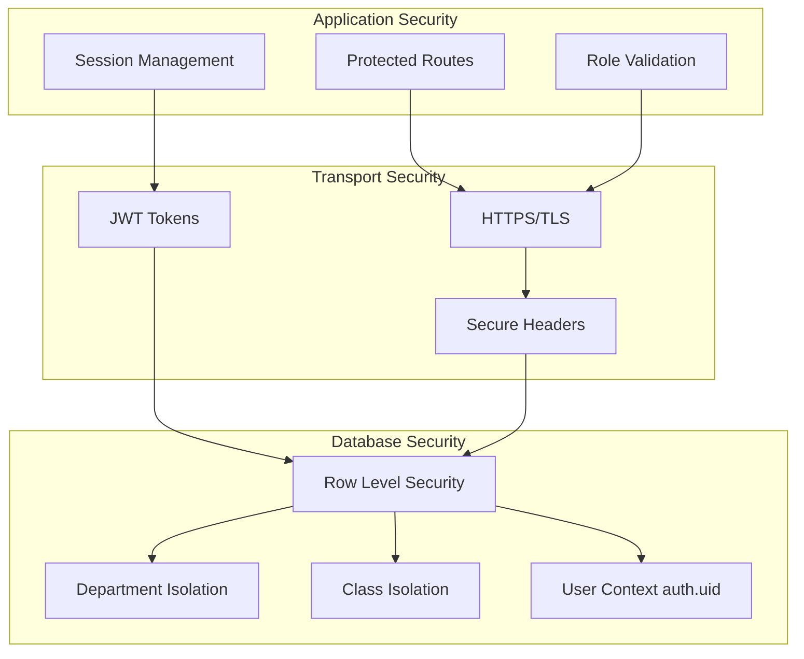

---

## 12. Deployment Pipeline

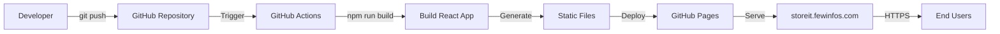

---

## 13. Multi-Role Access Control

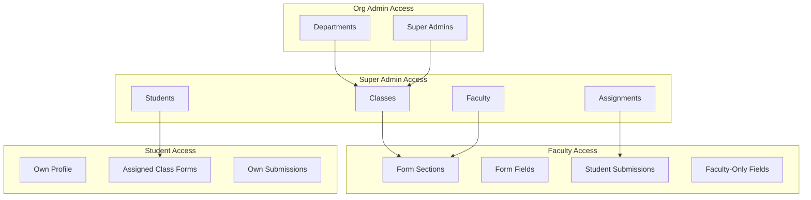

---

## 14. Dynamic Form Structure

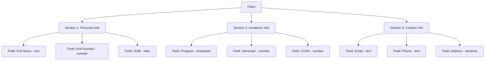

---

## 15. RLS Policy Enforcement

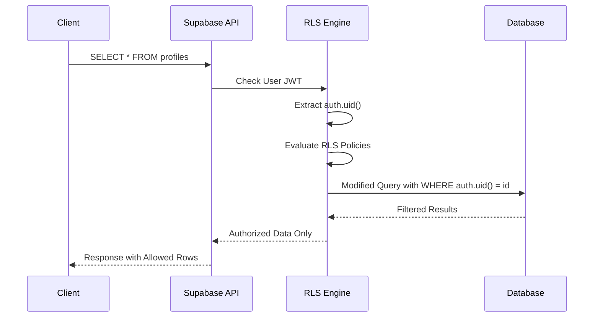

---

## 16. Technology Stack Layers

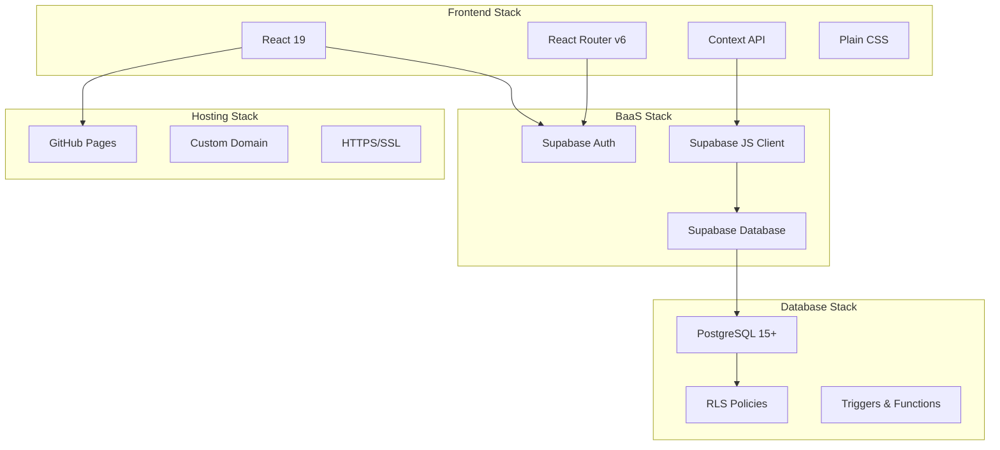

---

## Conclusion

These block diagrams illustrate the comprehensive architecture of StoreIt, demonstrating:

- **Modular Design** - Clear separation of concerns across layers
- **Security-First Approach** - Multiple layers of access control
- **Scalable Structure** - Serverless architecture supports growth
- **Data Integrity** - Cascade deletions maintain consistency
- **User-Centric Workflows** - Role-based functionality flows
- **Modern Technology** - Leveraging current best practices

The visual representations provide stakeholders, developers, and users with clear understanding of system components, data flows, and architectural decisions that make StoreIt an efficient, secure, and maintainable student management solution.
