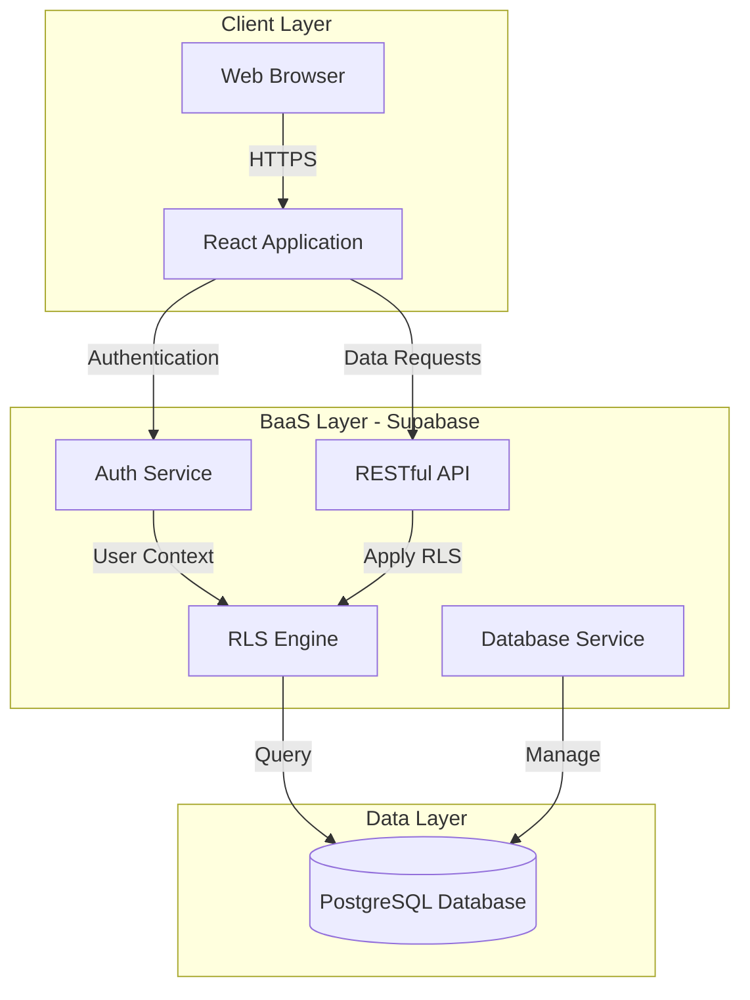
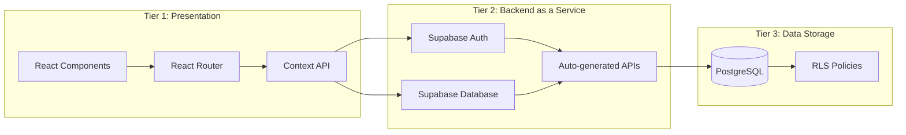
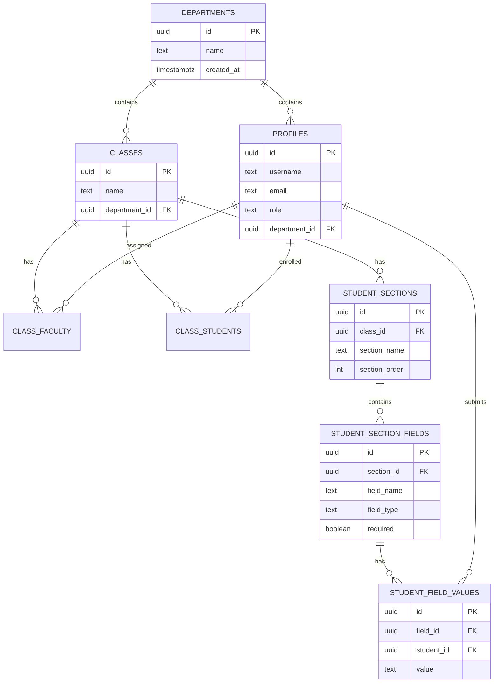
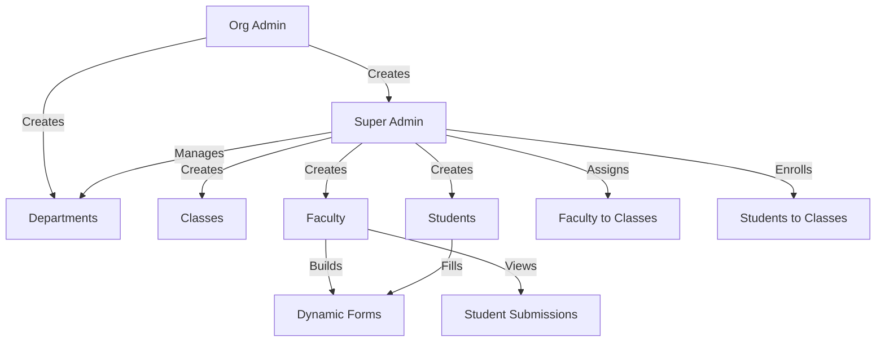
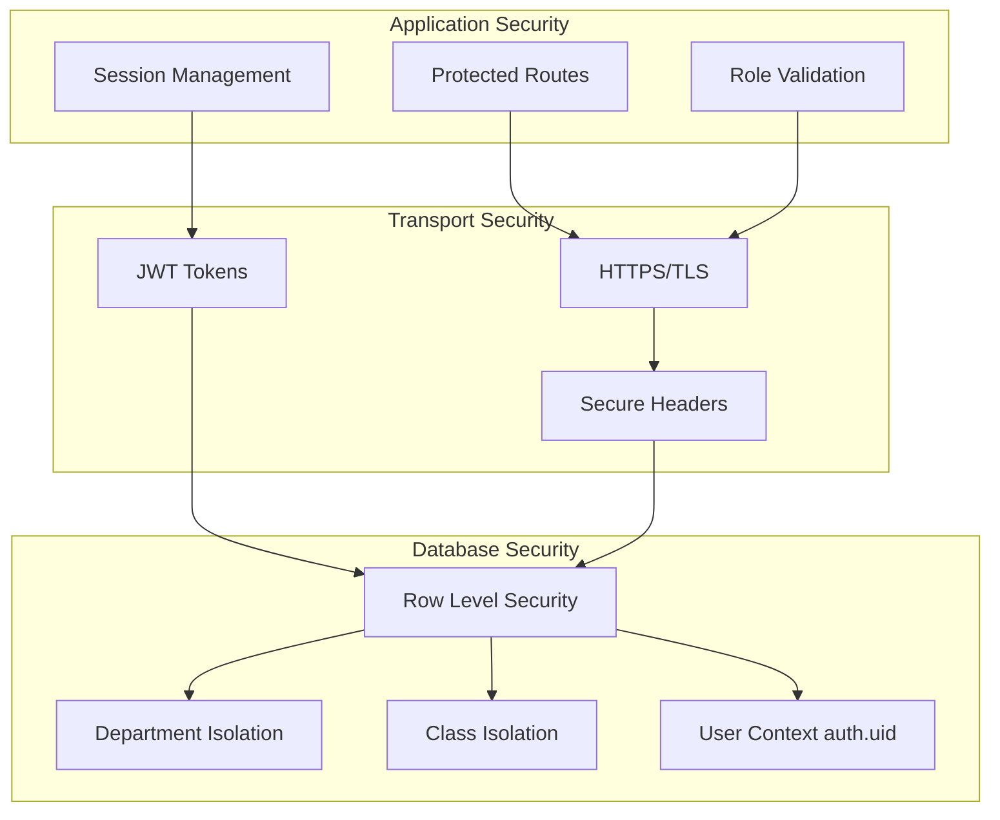
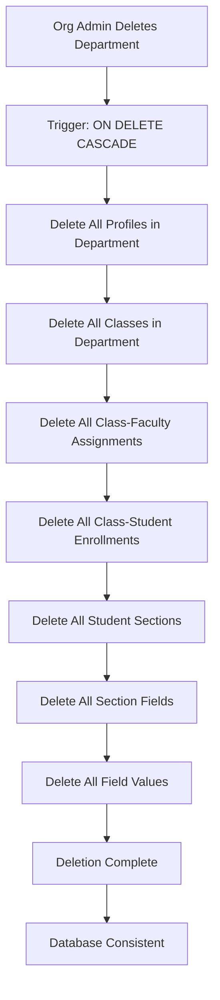
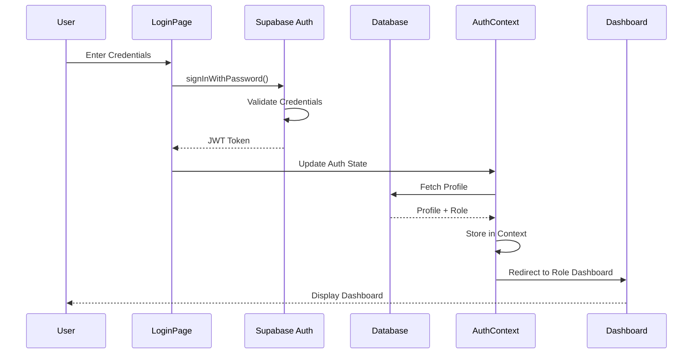
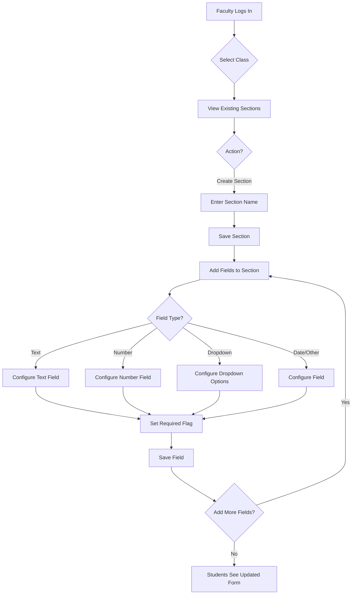
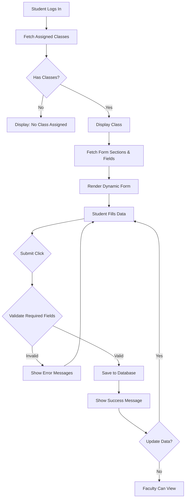
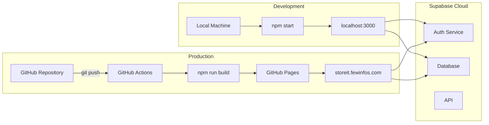

# Proposed System Architecture

## Overview

StoreIt implements a **serverless, three-tier architecture** leveraging modern web technologies and Backend-as-a-Service (BaaS) platforms to eliminate traditional backend infrastructure while maintaining security, scalability, and performance.



---

## Architecture Layers



### **1. Presentation Layer (Frontend)**

**Technology Stack:**
- **React 19** - Component-based UI framework
- **React Router v6** - Client-side routing and navigation
- **React Context API** - Global state management for authentication
- **Plain CSS** - Mobile-first responsive styling

**Key Components:**

#### Authentication Context (`AuthContext.js`)
- Manages user session state
- Listens to Supabase auth state changes
- Fetches and caches user profile and role
- Provides authentication status across the application

#### Protected Routes (`ProtectedRoute.js`)
- Implements role-based route guards
- Validates user permissions before rendering components
- Redirects unauthorized users to login page

#### Role-Specific Dashboards
- **OrgAdminDashboard** - Department and Super Admin management
- **SuperAdminDashboard** - Class, Faculty, Student management
- **FacultyDashboard** - Dynamic form builder and student data viewer
- **StudentDashboard** - Form submission interface

#### Reusable Components
- **FormBuilder** - Dynamic form creation interface
- **FieldRenderer** - Runtime field rendering based on type
- **Navbar** - Role-aware navigation menu
- **Footer** - Application footer

---

### **2. Backend-as-a-Service Layer (Supabase)**

**Core Services:**

#### **Authentication Service**
- Email/password authentication
- Session management with JWT tokens
- User creation and deletion
- Password reset functionality

#### **Database Service**
- **PostgreSQL 15+** - Relational database
- **Real-time subscriptions** - Live data updates (optional)
- **RESTful API** - Auto-generated from schema
- **Connection pooling** - Managed by Supabase

#### **Row-Level Security (RLS)**
- Database-enforced access control
- Policy-based permissions per table
- User context via `auth.uid()`
- Prevents API bypasses

---

### **3. Data Layer (Database Schema)**

**Entity Relationship Model:**

#### **User Management**
```
departments → profiles (users)
             ↓
         classes → class_faculty
                 → class_students
```

#### **Form System**
```
classes → student_sections → student_section_fields → student_field_values
        → faculty_sections → faculty_section_fields → faculty_field_values
```

**Key Tables:**

1. **departments** - Organizational units
2. **profiles** - User accounts with roles
3. **classes** - Academic classes per department
4. **class_faculty** - Faculty-class assignments
5. **class_students** - Student-class enrollments
6. **student_sections** - Form sections for students
7. **student_section_fields** - Individual form fields
8. **student_field_values** - Student-submitted data
9. **faculty_sections** - Faculty-only form sections
10. **faculty_section_fields** - Faculty-only fields
11. **faculty_field_values** - Faculty-submitted data

**Referential Integrity:**
- Cascade deletion on department removal
- Cascade deletion on class removal
- Cascade deletion on user removal
- Foreign key constraints enforce relationships



---

## System Architecture Characteristics

### **1. Serverless Architecture**

**Benefits:**
- No backend server to maintain
- No deployment complexity
- Auto-scaling handled by Supabase
- Pay-per-use pricing model
- Reduced infrastructure costs

**Implementation:**
- All business logic in React components
- Database operations via Supabase JS client
- Authentication handled by Supabase Auth
- No custom API endpoints required

---

### **2. Role-Based Access Control (RBAC)**

**Four-Tier Hierarchy:**



**Permission Model:**

| Role | Capabilities |
|------|-------------|
| **Org Admin** | Create departments, Create super admins |
| **Super Admin** | Create classes, Assign faculty, Enroll students |
| **Faculty** | Build forms, View student submissions, Create faculty-only fields |
| **Student** | View forms, Submit data, Update own data |

**Enforcement:**
- Application-layer checks in `ProtectedRoute.js`
- Database-layer policies in RLS
- Context-based authorization via `AuthContext`

---

### **3. Dynamic Form Architecture**

**Section-Based Design:**

Each class can have multiple sections, each section contains multiple fields:

```
Class → Section 1 → Field 1 (text)
                  → Field 2 (number)
                  → Field 3 (dropdown)
      → Section 2 → Field 4 (date)
                  → Field 5 (textarea)
```

**Supported Field Types:**
- `text` - Single-line text input
- `number` - Numeric input
- `date` - Date picker
- `textarea` - Multi-line text
- `dropdown` - Select from options
- `link` - URL/file upload link
- `checkbox` - Boolean yes/no

**Field Configuration:**
- Field name and type
- Required/optional flag
- Dropdown options (JSON array)
- Field ordering
- Upload link (for file references)

---

### **4. Security Architecture**



**Multi-Layer Security:**

#### Layer 1: Client-Side
- Protected routes prevent UI access
- Role validation in components
- Session expiration handling

#### Layer 2: Transport
- HTTPS enforced by Supabase
- JWT tokens in secure headers
- Token refresh mechanism

#### Layer 3: Database (Primary Security)
- Row-Level Security policies
- User context enforcement
- Department-based data isolation
- Class-based data isolation

**RLS Policy Examples:**

```sql
-- Students can only read their own profile
CREATE POLICY "Students can view own profile"
ON profiles FOR SELECT
TO authenticated
USING (auth.uid() = id AND role = 'student');

-- Faculty can view students in their classes
CREATE POLICY "Faculty can view class students"
ON student_field_values FOR SELECT
TO authenticated
USING (
  EXISTS (
    SELECT 1 FROM class_faculty cf
    WHERE cf.faculty_id = auth.uid()
    AND cf.class_id IN (
      SELECT cs.class_id 
      FROM class_students cs 
      WHERE cs.student_id = student_field_values.student_id
    )
  )
);
```

---

### **5. Data Consistency Architecture**

**Cascade Deletion:**



**Transaction Integrity:**
- PostgreSQL ACID compliance
- Foreign key constraints
- Unique constraints on assignments
- Default values for timestamps

---

## System Workflow

### **1. User Authentication Flow**



### **2. Form Creation Flow (Faculty)**



### **3. Form Submission Flow (Student)**



---

## Deployment Architecture



### **Development Environment**
- Local machine runs `npm start` (React Dev Server)
- Accessible at `http://localhost:3000`
- Connects to Supabase Cloud for auth and database

### **Production Environment**
- GitHub Repository hosts source code
- CI/CD Pipeline via GitHub Pages
- Static Build created with `npm run build`
- Hosted on `storeit.fewinfos.com`
- Connects to Supabase Production instance

**Build Process:**
1. `npm run build` - Creates optimized production build
2. Static files generated in `/build` folder
3. Deployed to GitHub Pages
4. Custom domain configured (CNAME)
5. HTTPS enforced

---

## Scalability Considerations

### **Horizontal Scaling**
- Supabase handles database scaling automatically
- CDN distribution for static assets
- Connection pooling managed by Supabase
- Read replicas available (Supabase Pro)

### **Performance Optimizations**
- React component memoization
- Lazy loading of routes (future enhancement)
- Database indexes on foreign keys
- Query optimization through RLS policies

### **Monitoring & Maintenance**
- Supabase dashboard for metrics
- Database query performance analysis
- Authentication logs
- Storage usage tracking

---

## Advantages of Proposed Architecture

1. **Zero Backend Maintenance** - No servers to manage or update
2. **Rapid Development** - Focus on UI/UX instead of backend APIs
3. **Built-in Security** - Database-enforced access control
4. **Cost Effective** - Pay only for usage, no idle server costs
5. **Easy Deployment** - Static site hosting, simple CI/CD
6. **Automatic Scaling** - Handles traffic spikes without configuration
7. **Real-time Capabilities** - Optional live updates via Supabase subscriptions
8. **Developer Friendly** - Modern React ecosystem, familiar tools

---

## Technology Justification

| Requirement | Technology Choice | Justification |
|------------|------------------|---------------|
| Frontend Framework | React 19 | Component reusability, large ecosystem, virtual DOM |
| Routing | React Router v6 | Industry standard, nested routes, loaders |
| State Management | Context API | Sufficient for auth state, no Redux complexity |
| Backend | Supabase | Serverless, PostgreSQL, RLS, auth built-in |
| Database | PostgreSQL | ACID compliance, JSON support, mature ecosystem |
| CSS | Plain CSS | No build complexity, mobile-first, full control |
| Hosting | GitHub Pages | Free, HTTPS, custom domains, simple deployment |

---

## Future Enhancements

1. **Email Notifications** - Supabase Edge Functions for alerts
2. **File Uploads** - Supabase Storage integration
3. **Export Functionality** - Generate reports (PDF/Excel)
4. **Bulk Operations** - Multi-select actions for admins
5. **Audit Logging** - Track all data modifications
6. **Real-time Updates** - Live form submissions for faculty
7. **Mobile App** - React Native version
8. **Analytics Dashboard** - Visualize student data trends

---

## Conclusion

The proposed architecture leverages modern serverless technologies to create a maintainable, secure, and scalable student management system. By eliminating traditional backend infrastructure and utilizing Supabase's managed services, StoreIt achieves enterprise-grade functionality with minimal operational overhead, making it ideal for educational institutions seeking cost-effective, flexible solutions for student data management.
